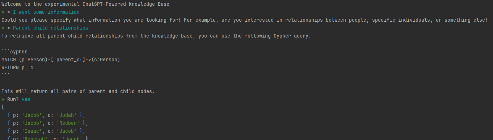

# Cypher Expert
Implementation of a Task-Oriented Dialog system with ChatGPT: a Cypher expert that can help the 
user of a knowledge-based system query it. It works with the common OpenAI API (not fine-tuned)
and leverages, on the one hand, ChatGPT's knowledge of the Cypher query language and, on the 
other hand, ChatGPT's operation that embeds code snippets in clearly demarcated snippets
(\```language ```). This enables natural language to be essentially ignored by the dialog system and
to be one direct channel of communication between the LLM and the user, while the presence of the
resulting code snippet consists of a separate (out-of-band-like) channel of communication of the LLM
and the dialog system.

## How to run

In order for the OpenAI API to be instantiated, one needs a `.env` file with the OpenAI key, like this:

```
OPENAI_API_KEY=xxxxxxxxxxxxxxxxxxxxxxxxxx
```

## Dialog State
A single user intent is modeled in this system: asking for information about the facts stored in a 
knowledge base. More intents can be added in the future (like, asking for the system to produce new 
facts coming from its general knowledge). This might necessitate a separate “router agent” 
(fancy speak for: a separate kind of request) to understand which the intent of the user is. For now, 
there is a single “agent” (again, fancy speak for: kind of request) that is instructed to help the user 
create Cypher queries on a knowledge base with a specific schema, and ask for clarifications if the
request is ambiguous or incomplete.

The dialog follows the statemachine in the image. A new question by the user starts a new stage of the 
dialog. The “context”, that is mentioned, is the relevant past prompts and responses (subject to a 
defined token count limit). Each stage of the interaction is considered complete when a query 
(or queries) is included in the chatbot response, and the user accepts it. So long as the chatbot 
keeps asking for clarifications, or the user has not accepted the queries suggested, the stage progresses,
accumulating context that is sent with the Completion request.


When the user accepts the suggested query, the Cypher code is parsed and executed, and its results are displayed. 
A sample interaction can be seen in the following image.



## Conclusion and further directions
Obviously, this is a demonstrational system that only scratches the surface. However, it 
demonstrates that there are domains that are well covered by the usual LLMs, without the need for 
fine-tuning. Using an LLM shortcuts the need for separate components for NLU (natural language 
understanding) and NLG (natural language generation), and only needs one to implement the, even more 
exotically named, components for DST (dialog state tracking) and DPL (dialog policy learning). 
[See description in https://towardsdatascience.com/creating-task-oriented-dialog-systems-with-langgraph-and-langchain-fada6c9c4983 ]. 
Because Cypher queries are written in a separate language, that is embedded in well-structured 
blocks that can be easily parsed, we can treat natural language as an opaque meta-language and 
track the status of the conversation by the presence of this “response” to the user, and the user action 
for accepting or rejecting it, without the need to do any language processing.


